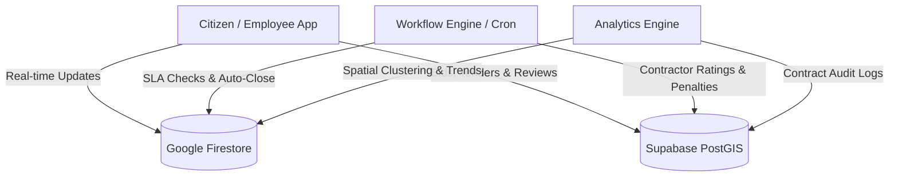

# 🏙️ Civic Issue Tracker


A state-of-the-art, cross-platform web and mobile application that connects citizens, municipal government departments, and private contractors to report, track, assign, bid on, and resolve civic issues (such as road damage, water leaks, electrical faults, sanitation, streetlights, and drainage) in real time. 

---

## 🏗️ Architecture Overview

The Civic Issue Tracker utilizes a **Hybrid Database Architecture** designed to optimize real-time synchronization, mobile responsiveness, and complex transactional integrity.



### 1. Google Firestore (Real-Time Node)
* **Purpose:** Handles low-latency, real-time sync of active complaints, status update feeds, field logs, notifications, and gamification rewards.
* **Collections:**
  * `issues`: Active and historical civic issues with live coordinate updates.
  * `issue_status_logs`: Sequence of chronological states through which an issue has transitioned.
  * `profiles`: Flat representation of user authorization and role settings.
  * `rewards`: Logs of credited points and activities for gamification.

### 2. Supabase / PostgreSQL + PostGIS (Transactional & Audit Node)
* **Purpose:** Manages highly structured relational schemas, municipal departments, the bidding system, contracts, and contractor audits.
* **Tables:**
  * `profiles` / `departments`: Relational directories.
  * `tenders` / `tender_bids`: Public contracting framework with digital signature logs.
  * `contracts` / `contract_areas`: Boundary mapping for private vendor coverage (PostGIS geometry).
  * `company_ratings`: Contractor scorecard (citizen rating, penalty points, delay records).
  * `company_employees`: Registered corporate staff and field engineers.
  * `community_reviews`: Geospatial proximity verification submissions by local citizens.

---

## 🎨 Design System: Neomorphism-Lite

The platform implements a soft, tactile, modern **Neomorphism-Lite Surface Design** to present a warm, approachable interface rather than a clinical, bureaucratic portal.

### Design Tokens & Color Palettes
* **Base Background:** `#EDEBE4` (Warm neutral mid-tone necessary for dual-shadow projection)
* **Raised Surface:** `#F5F3EC` (Extruded cards, inputs, and button tiles)
* **Border:** `#DDD9CE` (Fine structure alignment)
* **Primary Accent:** `#1D9E75` (Reserved exclusively for CTA triggers and active status indicators)
* **Shadow Values:**
  * Raised: `6px 6px 12px rgba(0,0,0,0.08), -6px -6px 12px rgba(255,255,255,0.75)`
  * Inset (Pressed states/active inputs): `inset 4px 4px 8px rgba(0,0,0,0.09), inset -4px -4px 8px rgba(255,255,255,0.75)`

### Custom UI Variants
1. **Dark Mode:** Retunes shadows and shifts the background to `#2C2A26` and raised surfaces to `#3A3833` to prevent mudded or high-contrast glow artifacts.
2. **High-Contrast (Accessible) Mode:** Disables all soft shadows, replacing depth cues with high-contrast flat borders (`#1A1A18`), pure white `#FFFFFF` fields, and solid `#000000` text for visually impaired and senior citizens in accordance with **WCAG AA (4.5:1 minimum contrast)**.

---

## 👥 Role-Based Feature Guide

The application divides workflows into six distinct roles, creating an integrated loop from reporting to resolution.

### 1. Citizens
* **Smart Issue Reporting:** Citizens trigger the reporting flow with instant category selection. The application grabs geo-coordinates and prompts for a photo.
* **Anti-Spam Duplicate Checker:** Proximity checks query Firestore for unresolved issues of the same type within **100 meters**. If duplicates exist, the citizen is prompted to **"Support / Back"** the existing report (boosting its priority) rather than filing a redundant ticket.
* **Interactive Mapping:** Dropping and cluster-grouping pins dynamically using Leaflet Maps.
* **Verification & Rework Loop:** Once an issue is marked resolved, the reporting citizen has exclusive rights to verify it. If rated **< 2.5 stars**, the system automatically flags rework and re-assigns the issue to the company for a second repair. Ratings **>= 2.5 stars** close the issue.
* **Gamification Tiers:** Citizens accumulate XP (points) for reports and verifications:
  * **Bronze (0-200 XP):** Basic reporter badge.
  * **Silver (200-500 XP):** Priority customer support.
  * **Gold (500-1000 XP):** Municipal tax credit eligibility.
  * **Platinum (1000+ XP):** Full civic tax offset.

### 2. Municipal Department Admins
* **Dual Operation Modes:** Admins can toggle individual departments (Roads, Water, Electricity, etc.) between:
  * `DEPARTMENT` Mode: Work orders are assigned internally to municipal field employees.
  * `TENDER` Mode: Work orders are bundled and assigned to external private contractors through public procurement.
* **Publish Tenders:** Publish public contracts complete with Estimated Budgets, Earnest Money Deposits (EMD), Bid Deadlines, and Scope of Work.
* **Contractor Performance Scorecard:** Dynamic monitoring of active external contractors, displaying Completed vs. Rejected issues, Citizen ratings, Penalties accumulated, and Automated Risk Audit scores.

### 3. Private Contractors (Company Admins)
* **Bidding Portal:** Browse open department tenders, upload technical and financial proposals, specify estimated completion times, and execute digital signature logs.
* **Work Order Hub:** Distribute awarded public contracts to company field staff.
* **Field Staff Management:** Add, monitor, and manage corporate field engineers, checking their active field assignments.

### 4. Contractor Employees (Field Engineers)
* **Specialized Field Route:** A lightweight mobile-first layout prioritizing tasks.
* **Interactive Operations Workflow:** 
  $$\text{Accept Task} \longrightarrow \text{Travel to Site} \longrightarrow \text{Begin Work} \longrightarrow \text{Upload Photos} \longrightarrow \text{Submit Review}$$
* **Proof of Work:** Mandatory photographic upload at three intervals: **Before Repair**, **Progress Checkpoint**, and **After Repair** (leveraging Capacitor's native camera plugin).

### 5. Municipal Field Staff
* **In-House Assignments:** A dedicated panel to view, accept, perform, and log tasks assigned directly by the department head.

### 6. Government Officers (Auditors)
* **System Health Monitor:** Audit log reviews, department resolution metrics, system-wide SLA breach rates, and overall citizen satisfaction indicators.

---

## ⚙️ Automated Workflow & Analytics Engines

A background server runs scheduled tasks to maintain system integrity and analyze long-term patterns.

### 1. Workflow & SLA Engine (`/api/cron/workflow-engine`)
* **Community Review Auto-Close:** Issues remaining in `COMMUNITY_REVIEW` are processed automatically. If an issue gets 10+ ratings, or sits in review for 7+ days, the cron calculates the moving average. If average rating $\ge 2.5$, the issue is closed; if $< 2.5$, it is flagged as rejected, and a **10-point penalty** is written to the contractor's profile.
* **SLA Breach Logs:** Computes elapsed hours against target resolution parameters in active contracts, applying automatic penalty logs on breach.

### 2. Pattern Analytics Engine (`/api/cron/run-analysis`)
* **Spatial Clustering:** Implements DBSCAN-style calculations using Havesine metrics to bundle local issues into recurring hot-spots.
* **Seasonal Decomposition:** Examines historical logs over a 12-month window to extract trend and seasonal factors, predicting upcoming recurring failures.
* **Weather Statistical Testing:** Computes correlations between environmental events (rainfall, temperature) and specific civic failures (water leaks, potholes) to forecast department staffing needs.

---

## 🚀 Getting Started

### Prerequisites
* **Node.js** (v20+)
* **npm**
* **Android Studio** (For building the native Android package)

### Installation
1. Clone the repository:
   ```bash
   git clone https://github.com/Modi-Krish/Civic-Issue-Tracker-.git
   cd civic_issue_tracker
   ```
2. Install dependencies:
   ```bash
   npm install
   ```
3. Set up environment variables:
   ```bash
   cp .env.example .env.local
   ```
   Fill in `.env.local` with your Supabase credentials, Firebase Web API keys, and service roles.

4. Run the local Next.js server:
   ```bash
   npm run dev
   ```
   Access the interface at [http://localhost:3000](http://localhost:3000).

---

## 📱 Android Native Build (Capacitor)

The codebase compiles into a native Android application using Capacitor.

1. Build static output files:
   ```bash
   npm run build:android
   ```
2. Open Android Studio to build the debug/release APK:
   ```bash
   npm run cap:open
   ```
3. Run directly on an emulator or USB-connected device:
   ```bash
   npm run cap:run
   ```

---

## 🤝 Contributing
Please read [CONTRIBUTING.md](CONTRIBUTING.md) for style guidelines, pull request submission procedures, and code of conduct details.

## 🛡️ Security
For information on vulnerability reporting, please review our [SECURITY.md](SECURITY.md).

## 📄 License
This project is licensed under the MIT License - see the [LICENSE](LICENSE) file for details.
